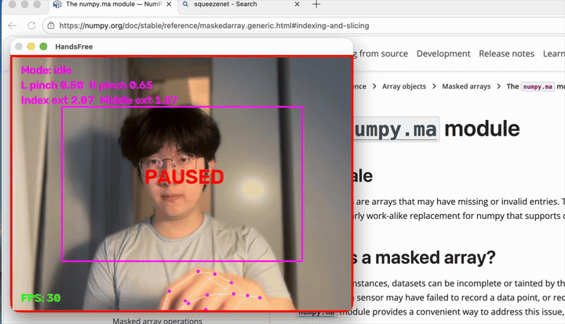
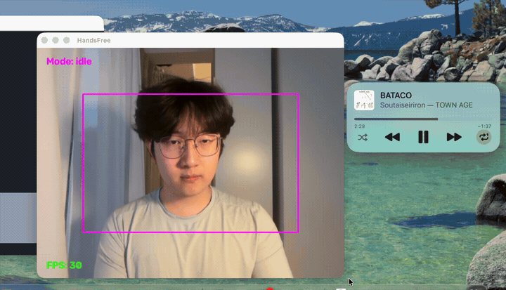
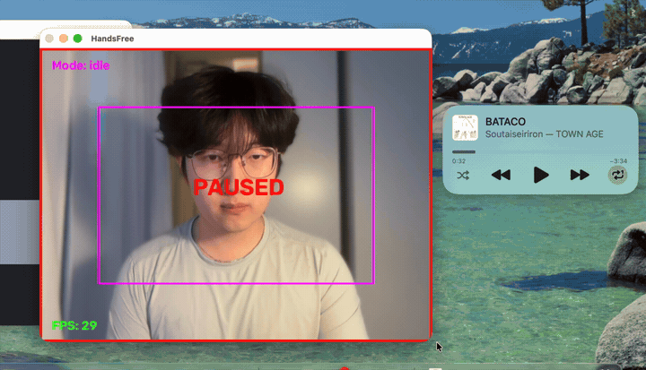
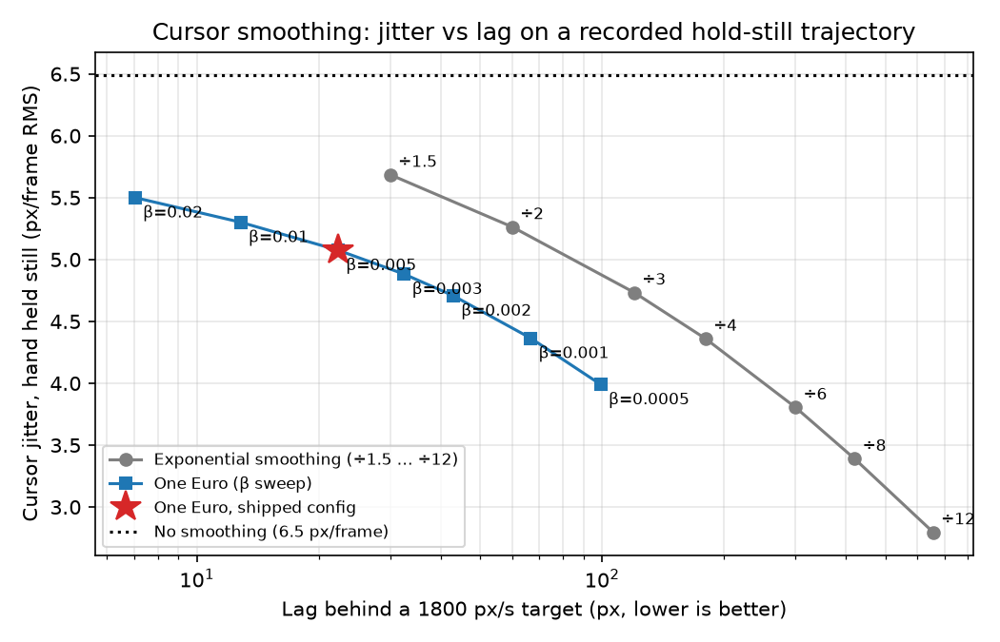

# HandsFree

[](https://github.com/tsz-1/handsfree/actions/workflows/ci.yml)

Touchless computer control with a regular webcam: move, click, drag and scroll with one hand,
and bind static hand poses to shortcuts with a classifier trained on your own recordings.

Move, click, and drag.



Python · MediaPipe Hand Landmarker · OpenCV · scikit-learn · pyautogui/Quartz

## Why this exists

The usual "virtual mouse" tutorial maps the fingertip to the cursor and clicks when two
fingertips get close. It has four problems that make it unusable for real work, and this
project is about fixing each one properly:

| Problem in the tutorial version | What HandsFree does |
| --- | --- |
| A held pinch fires a click every frame | Gesture **state machine**: click on release, drag if held, one event per gesture |
| The pinch threshold is in pixels, so it only works at one distance from the camera | Thresholds in **palm-length units** with **hysteresis** (enter 0.30, exit 0.40) |
| Fixed exponential smoothing: either jittery or laggy | **One Euro filter**: heavy smoothing at rest; at 1800 px/s it lags 22 px, versus 420 px for fixed smoothing (see benchmark) |
| Closing the pinch drags the fingertip, so clicks land off-target | Click is placed where the cursor was **150 ms before** the pinch closed |

On top of that, a small, honest ML component: a per-user static-pose classifier evaluated
with leave-one-session-out cross-validation, gated so it does not fire while the hand is
moving, half out of frame, or doing a mouse gesture.

## Gestures

| Gesture | Action |
| --- | --- |
| Index finger up | Move cursor |
| Thumb–index pinch, quick release | Left click; two pinches within 0.8 s = double-click |
| Thumb–index pinch, hold > 0.3 s | Drag; release to drop |
| Thumb–middle pinch | Right click |
| Index + middle up, move hand up/down | Scroll, joystick-style (farther from start = faster) |

### Pose shortcuts (trainable)

| Pose | Default binding (`config.yaml`) |
| --- | --- |
| Fist, hold 0.4 s | Pause / resume control |
| Thumbs up | Play / pause media |
| Rock 🤘 | Screenshot (⌘⇧3) |
| Call 🤙 | Mission Control (⌃↑) |

Bindings accept `keys: [...]` (any pyautogui hotkey), `media: play|next|previous|mute|volume_up|volume_down`,
or `action: toggle_pause`.

Thumbs up plays or pauses media; a fist pauses and resumes control.



The rock pose takes a screenshot.



## Quick start

```bash
python -m venv venv && source venv/bin/activate
pip install -e ".[dev]"
python tools/download_model.py      # MediaPipe hand_landmarker.task (~8 MB)
python -m handsfree --dry-run       # preview: recognizes gestures, does not touch the mouse
python -m handsfree                 # real control; press q in the preview window to quit
```

macOS: give your terminal **Camera** and **Accessibility** permissions (System Settings →
Privacy & Security). Tested on macOS with Python 3.12–3.14. Cursor control should work on
Windows/Linux through pyautogui but is untested there; media keys and click-count double-clicks
use macOS APIs.

Tuning guide (Chinese): [docs/TUNING.zh-CN.md](docs/TUNING.zh-CN.md).
Design notes explaining each decision with numbers (Chinese): [docs/DESIGN.zh-CN.md](docs/DESIGN.zh-CN.md).

### Train your own pose shortcuts

```bash
python tools/record.py     # press 0–9 to start a labeled clip, space to stop; 2+ sessions
python tools/train.py      # LOSO cross-validation over 4 models, saves the best + reports/
python tools/dataset.py check   # sanity-check labels via finger-extension statistics
```

While running, press `n` to save the last 1.5 s as hard negatives when a shortcut fires by
mistake, then retrain.

## How it works

```
webcam ─► HandTracker ─► GestureInterpreter ─► MouseController ─► OS (pyautogui / Quartz)
 (OpenCV)  MediaPipe      pinch hysteresis      One Euro filter
           21 landmarks   FSM: IDLE/PINCH/       click rewind
                          DRAG/RIGHT/SCROLL      drag events
                │
                └─────► GestureClassifier ─► ShortcutEngine ─► keys / media / pause
                        42-d pose features    hold + cooldown
                        (wrist-centred,       gated by: mode == IDLE,
                        palm-scaled,          hand fully in frame,
                        rotation-normalised,  wrist speed < 1.5 palm/s
                        geometry-mirrored)
```

- `handsfree/tracker.py` – MediaPipe Tasks wrapper, VIDEO mode with monotonic timestamps.
- `handsfree/gestures.py` – palm-normalised metrics, `PinchDetector` with hysteresis and a
  finger-extension guard (a fist is not a pinch), the gesture FSM, scroll with dead zone and a
  grace period so a one-frame dropout does not flip the scroll direction.
- `handsfree/filters.py` – One Euro filter (`min_cutoff` 0.5 Hz, `beta` 0.005).
- `handsfree/actions.py` – screen mapping of an equal-gain active region, click rewind,
  macOS drag events, click-count double-clicks, media keys.
- `handsfree/classifier.py` – pose features + EMA-smoothed logistic regression.
- `handsfree/shortcuts.py` – hold/cooldown engine and the motion / in-frame gates.

## Benchmarks

Measured with `tools/benchmark.py` on an Apple Silicon MacBook, built-in camera at 640×480,
1710×1107 screen, MediaPipe on CPU. `tools/plot_benchmark.py` re-runs the smoothing comparison
offline on the recorded trajectory.

**Per-frame latency** (598 frames). 47.5 FPS is the throughput of camera capture + detection + gesture logic only; drawing the preview and delivering the mouse event to the OS are not included. Camera capture is the bottleneck:

| Stage | p50 | p95 |
| --- | --- | --- |
| Camera capture | 13.2 ms | 15.2 ms |
| Hand landmark detection | 7.6 ms | 9.4 ms |
| Gestures + filter + pose classifier | 0.2 ms | 0.2 ms |
| **Total** | **21.1 ms** | **24.0 ms** |

**Cursor smoothing.** Jitter is the RMS frame-to-frame cursor displacement while the hand is
held still (5 s, recorded). Lag is the distance behind a target moving at 1800 px/s after 2 s,
computed synthetically with the same filter code.

| Smoothing | Jitter (px/frame) | Lag at 1800 px/s |
| --- | --- | --- |
| None | 6.5 | 0 px |
| Exponential ÷8 (the tutorial default) | 3.4 | 420 px |
| **One Euro (shipped)** | **5.1** | **22 px** |



On this recorded hold and a synthetic constant-speed target, One Euro is ahead of exponential
smoothing: at about 4.4 px of jitter the exponential filter lags 180 px and One Euro lags 67 px;
at about 30 px of lag the exponential filter jitters 5.7 px and One Euro jitters 5.1 px. The
shipped `beta` sits at the low-lag end on purpose; a hand held in the air has real tremor of
several pixels per frame, and hiding all of it costs responsiveness.

**Pose classifier** (`reports/metrics.json`, 3 recording sessions, 3,788 frames, 6 classes
including `none`). Evaluation is **leave-one-session-out**: train on two sessions, test on the
third, so lighting, distance and hand angle differ between train and test.

| Model | Accuracy | Macro F1 | Latency / frame |
| --- | --- | --- | --- |
| **Logistic regression (shipped)** | **86.8 %** | **0.865** | **0.08 ms** |
| MLP | 83.4 % | 0.815 | 0.08 ms |
| Random forest (200 trees) | 83.5 % | 0.828 | 3.9 ms |
| k-NN | 82.4 % | 0.801 | 0.43 ms |

The same data with a random per-frame split scores 98.4 %: consecutive frames of one clip are
near-duplicates, so a random split leaks and overstates accuracy by ~12 points. Confusion
matrix: `reports/confusion_matrix.png` (most errors: `call` ↔ `open_palm`).

## Testing

```bash
ruff check handsfree tools tests
pytest -q          # 47 tests: filters, FSM, actions, features, shortcuts, dataset tools
```

Tests use synthetic hands (`tests/handgen.py`) and a stubbed pyautogui, so they run headless;
CI runs them on Ubuntu under Xvfb.

## Known limitations

- One hand, roughly upright and facing the camera; the finger-up heuristic used for scrolling
  assumes that orientation.
- The pose classifier is per-user: it is trained on the author's hand. Record your own sessions
  (`tools/record.py`) before enabling shortcuts.
- `call` is confused with `open_palm` about 20 % of the time on held-out sessions.
- Media keys and double-clicks use macOS-specific APIs (pyautogui's public API cannot express
  either on macOS).
- No calibration UI; thresholds are edited in `config.yaml`.

## Project layout

```
handsfree/        package: app, tracker, filters, gestures, actions, classifier, shortcuts
tools/            download_model, record, dataset, train, benchmark, plot_benchmark
tests/            pytest suite + synthetic hand generator
reports/          metrics.json, confusion_matrix.png, benchmark.json, smoothing_tradeoff.png
docs/             tuning guide
config.yaml       camera, thresholds, filter parameters, shortcut bindings
```
